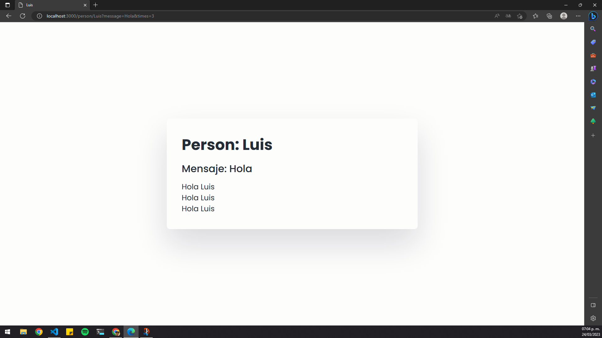

## Practica 14 - Query string

En esta práctica Query string, se muestra una forma de pasar información adicional a través de una URL en una solicitud HTTP GET.

En la línea de código:

```js
app.get("/person/:id", (req, res) => {...}
```

del archivo server.js, la ruta utiliza un parámetro de ruta llamado id, lo que significa que cualquier valor que se pase después de /person/ será asignado al objeto req.params.id de la solicitud.

Además, se pueden pasar parámetros adicionales en la URL utilizando la sintaxis **?clave=valor**. Por ejemplo, si la URL es **/person/Luis?message=Hola&times=3**, entonces el valor de req.query.message será "Hola" y el valor de req.query.times será "3":




Luego, en la vista person.ejs, se usan los valores de ID, MESSAGE y TIMES para mostrar información personalizada. En este caso, si el valor de MESSAGE es "Hola", "Adios" o "Bienvenido", se muestra un mensaje junto con el ID de la persona, y se muestra el mensaje la cantidad de veces especificada por TIMES. De lo contrario, se muestra un mensaje de error.
