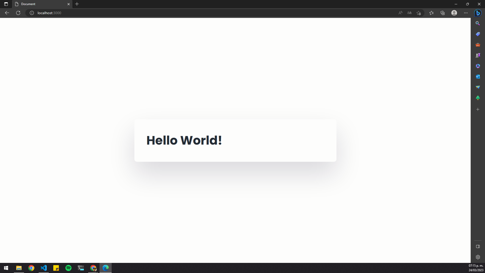
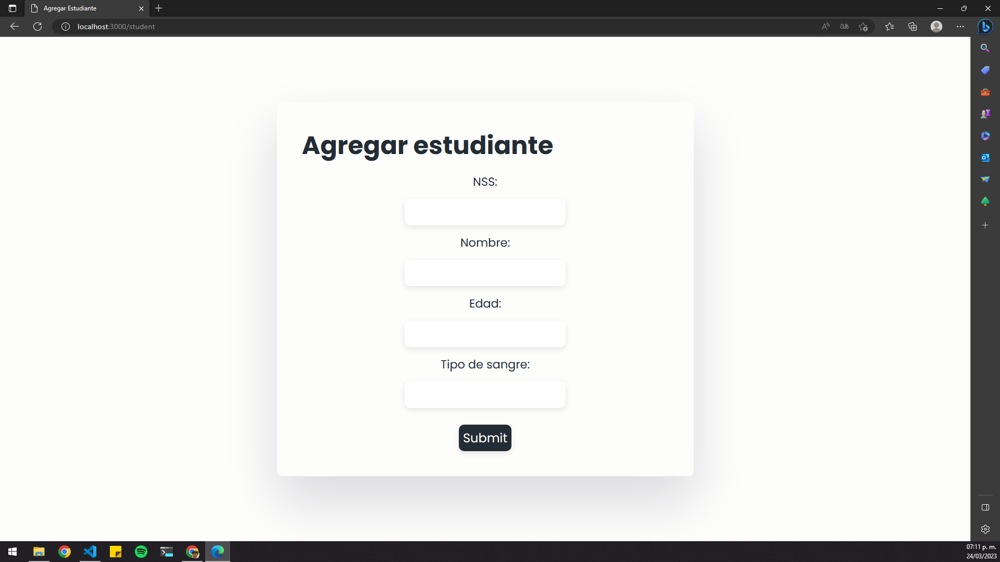
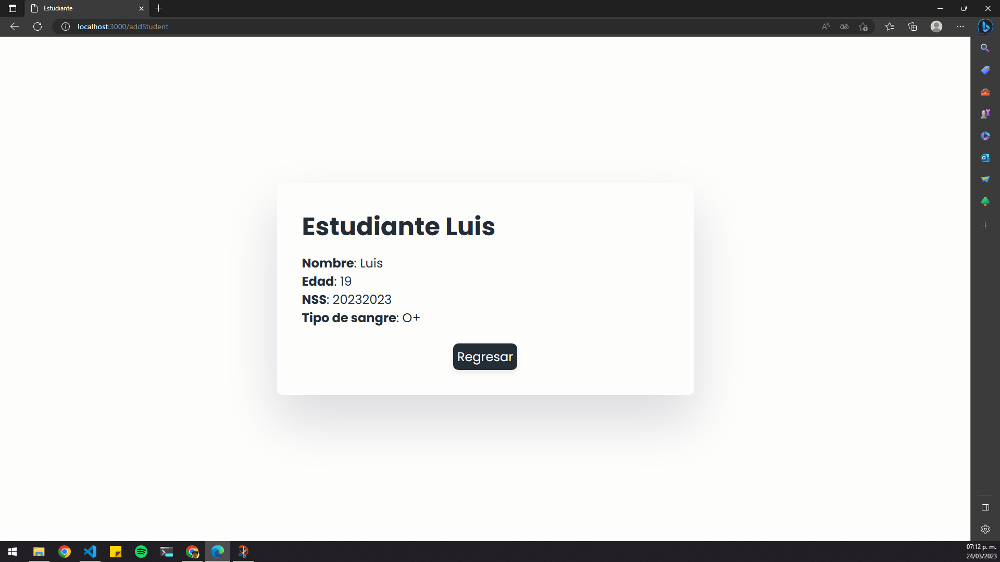

## Practica 15 - Peticiones POST

Esta práctica utiliza el framework Express de Node.js para crear un servidor web que maneje solicitudes POST y GET. El servidor maneja la solicitud GET en la ruta "/" y devuelve una página HTML simple que muestra "Hello World!".

Cuando se solicita la ruta "/student" con una solicitud GET, se devuelve una página HTML que contiene un formulario para agregar información del estudiante, incluyendo su NSS, nombre, edad y tipo de sangre. Este formulario tiene una acción definida como "/addStudent" con el método POST.

Cuando se envía el formulario con una solicitud POST, la ruta "/addStudent" maneja la solicitud y procesa los datos del formulario. Luego, se utiliza la plantilla EJS para renderizar la página "displayData.ejs" con los datos del estudiante ingresados en el formulario. Los datos del formulario se pasan a la plantilla a través de un objeto que contiene los valores de "nombre", "edad", "nss" y "tipoSangre".

La plantilla "displayData.ejs" muestra los datos del estudiante en una lista, y también incluye un botón para regresar a la página "/student". Esto permite al usuario agregar información de otro estudiante si lo desea.

En resumen, esta práctica utiliza Express y EJS para crear un servidor web que maneje solicitudes POST y GET, permitiendo a los usuarios agregar información del estudiante y mostrarla en una página separada.