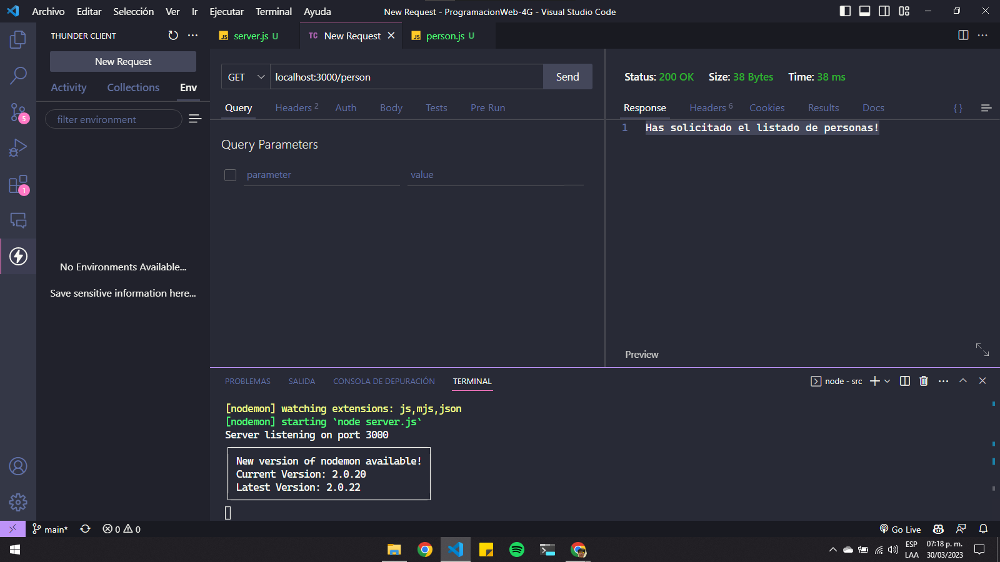

## Practica 16 - Router y Postman

Esta práctica es sobre cómo utilizar un router en Express.js para manejar una solicitud GET a la ruta '/person'.

En el archivo 'src/routes/person.js', se importa Express y se utiliza el método Router() para crear una instancia de un enrutador. A continuación, se define una ruta GET en el enrutador que responde a la solicitud con el mensaje "Has solicitado el listado de personas!".

```js
const express = require("express");

const router = express.Router();

router.get("/person", (req, res) => {
  res.send("Has solicitado el listado de personas!");
});

module.exports = router;
```

En el archivo 'src/server.js', se importa Express y se crea una instancia de la aplicación. Luego, se importa el enrutador 'personsRoute' desde el archivo 'src/routes/person.js' y se utiliza el método 'use()' de la aplicación para agregar este enrutador a la aplicación principal.

Además, se utiliza el método 'set()' de la aplicación para establecer el motor de plantillas EJS como motor de visualización. Se utiliza el método 'use()' de la aplicación para servir archivos estáticos desde la carpeta 'public' en la ruta '/assets'. Finalmente, se inicia el servidor en el puerto 3000 o en el puerto definido en la variable de entorno 'PORT'.

```js
const express = require("express");

const app = express();

let personsRoute = require("./routes/person");

app.set("view engine", "ejs");
app.use(personsRoute);

app.use("/assets", express.static(__dirname + "/public"));

let PORT = process.env.PORT || 3000;

app.listen(PORT, () => {
  console.log(`Server listening on port ${PORT}`);
});
```

Con esta configuración, cuando se solicita la ruta '/person' en el servidor, el enrutador definido en 'src/routes/person.js' maneja la solicitud y devuelve el mensaje "Has solicitado el listado de personas!".

Puedes probar esto utilizando una herramienta de prueba de API como Postman (o en mi caso utilicé Thunder Client desde VSC) para enviar una solicitud GET a 'localhost:3000/person'.


