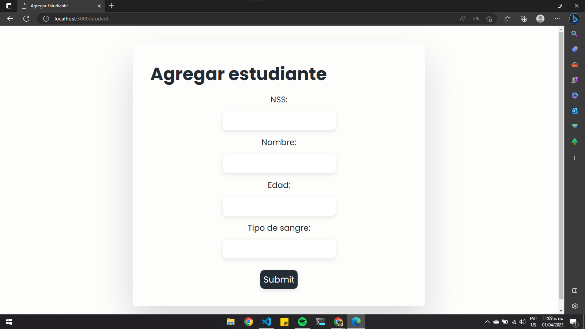
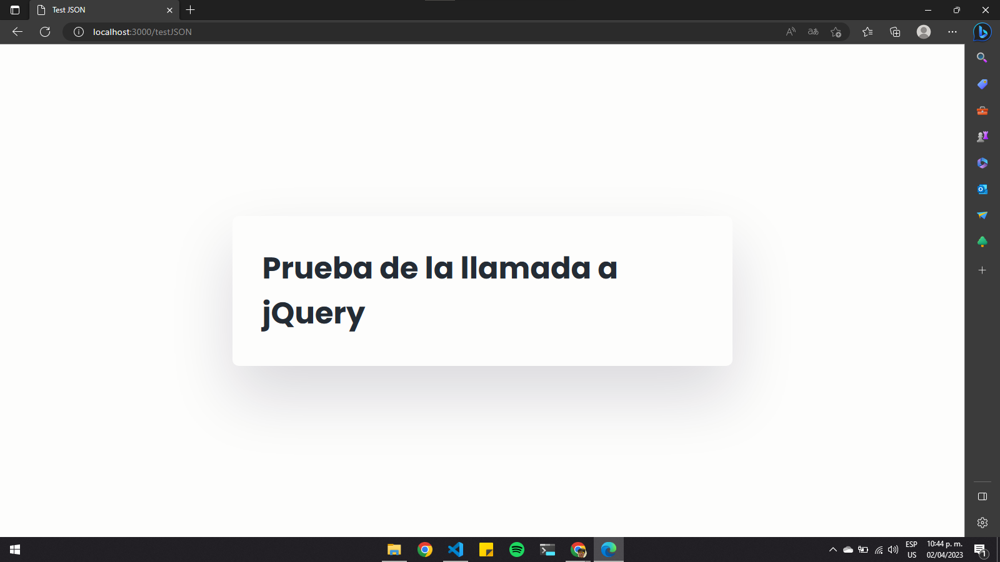
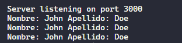

## Practica 17 - POST requests + JSON

Esta práctica implementa una serie de rutas y vistas en una aplicación web utilizando el framework Express de Node.js.

En el archivo src/routes/person.js se definen varias rutas utilizando el método Router de Express. La ruta /student es un GET que renderiza la vista student.ejs, la cual contiene un formulario que envía un POST a la ruta /addStudent. Esta ruta procesa los datos enviados por el formulario y los muestra en la vista displayData.ejs.

La vista testJSON.ejs es contiene una llamada AJAX mediante jQuery que envía una solicitud POST al servidor a través de la ruta /personJSON, enviando un objeto JSON con los campos "nombre" y "apellido". El objetivo de esta vista es probar si el servidor está correctamente configurado para manejar solicitudes POST con datos JSON.

En consola tenemos este resultados:

En resumen, esta práctica muestra cómo manejar solicitudes POST y trabajar con datos en formato JSON utilizando Express y EJS en Node.js.
