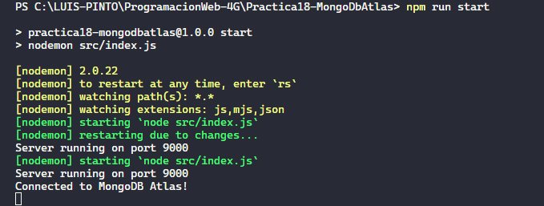

## Practica 18 - Utilizando el servicio de Mongo DB Atlas

Esta práctica utiliza el servicio de MongoDB Atlas para conectar una aplicación Node.js con una base de datos MongoDB alojada en la nube.

En el archivo **"src/index.js"**, se importan las dependencias necesarias, se crea una instancia de la aplicación Express, se establece el puerto de escucha y se definen las rutas de la aplicación.

```js
const express = require("express");
const mongoose = require("mongoose");
require("dotenv").config();

const app = express();

const port = process.env.PORT || 9000;

// Routes
app.get("/", (req, res) => {
  res.send("Welcome to my API!");
});
```

Luego, se utiliza la biblioteca mongoose para conectarse a la base de datos MongoDB alojada en la nube a través de la cadena de conexión especificada en el archivo ".env". La cadena de conexión contiene las credenciales de autenticación y la información del clúster de MongoDB Atlas al que se desea conectarse.

```js
// Connect to MongoDB
mongoose
  .connect(process.env.MONGODB_URI)
  .then(() => {
    console.log("Connected to MongoDB Atlas!");
  })
  .catch((err) => {
    console.error(err);
  });

app.listen(port, () => {
  console.log(`Server running on port ${port}`);
});
```

Finalmente, se inicia el servidor y se imprime un mensaje en la consola que indica que la aplicación está en ejecución y conectada a la base de datos MongoDB.



El archivo ".env" contiene variables de entorno que se utilizan en la aplicación, en este caso, la cadena de conexión a MongoDB Atlas. Estas variables se establecen en tiempo de ejecución y se mantienen separadas del código fuente de la aplicación, lo que permite una mayor seguridad y portabilidad.
