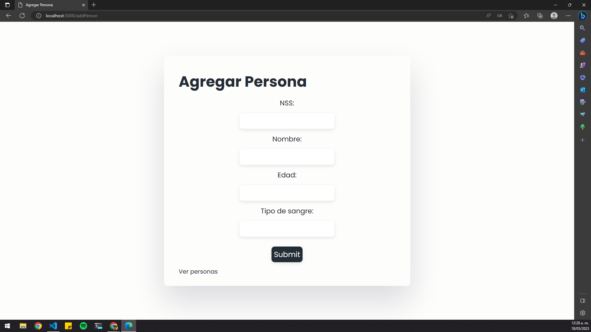
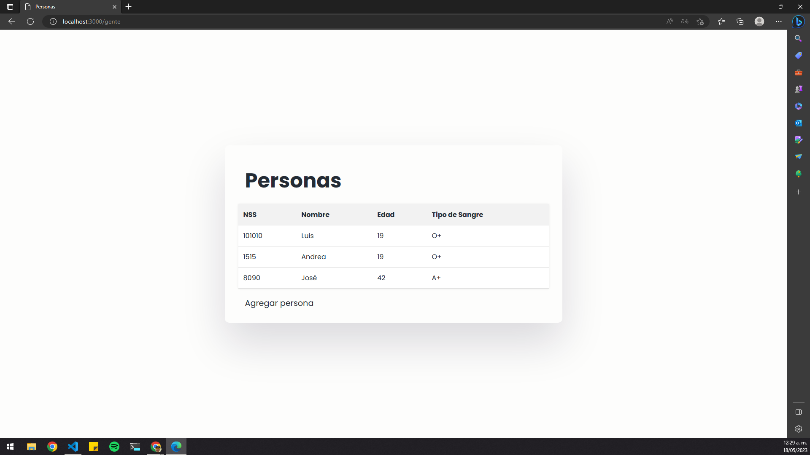

## Practica 20 - Agregar nuevo documento a la colección de Mongo DB

### Archivo persons.js en src/models

```js
const mongoose = require("mongoose");

let PersonSchema = new mongoose.Schema({
  nombre: String,
  edad: Number,
  tipoSangre: String,
  nss: String,
});

module.exports = mongoose.model("Persons", PersonSchema);
```

Este archivo define el esquema del modelo Person utilizando Mongoose. El esquema tiene propiedades como nombre, edad, tipoSangre y nss que representan los datos de una persona.

### Archivo persons.js en src/routes

```js
const express = require("express");
const router = express.Router();
const mongoose = require("mongoose");

let Person = require("../models/persons");

// Ruta GET para obtener todas las personas
router.get("/gente", async (req, res) => {
  const Persons = await Person.find({});
  res.render("persons", { Persons });
});

// Ruta GET para mostrar formulario de agregar persona
router.get("/addPerson", (req, res) => {
  res.render("addPerson");
});

// Ruta POST para agregar una nueva persona
router.post("/addPerson", async (req, res) => {
  const newPerson = Person({
    nombre: req.body.nombre,
    edad: req.body.edad,
    tipoSangre: req.body.tipoSangre,
    nss: req.body.nss,
  });

  newPerson
    .save()
    .then((data) => {
      res.redirect("/gente");
    })
    .catch((error) => {
      res.json({ message: error });
    });
});

module.exports = router;
```

Este archivo define las rutas relacionadas con las personas. Hay una ruta GET en /gente que obtiene todos los documentos de la colección y renderiza una plantilla llamada persons.ejs con los datos de las personas. También hay una ruta GET en /addPerson que renderiza una plantilla llamada addPerson.ejs para agregar una nueva persona, y una ruta POST en /addPerson que guarda los datos enviados a través del formulario y redirige a la ruta /gente.

### Archivo addPerson.ejs en src/views

```html
<!DOCTYPE html>
<html lang="en">
  <head>
    <meta charset="UTF-8" />
    <meta http-equiv="X-UA-Compatible" content="IE=edge" />
    <meta name="viewport" content="width=device-width, initial-scale=1.0" />
    <title>Agregar Persona</title>
    <!-- CSS -->
    <link rel="stylesheet" href="/assets/style.css" type="text/css" />
  </head>
  <body>
    <main>
      <h1>Agregar Persona</h1>

      <form action="/addPerson" method="POST">
        <label for="nss"> NSS: </label>
        <input type="text" id="nss" name="nss" />

        <label for="nombre"> Nombre: </label>
        <input type="text" id="nombre" name="nombre" />

        <label for="edad"> Edad: </label>
        <input type="text" id="edad" name="edad" />

        <label for="tipoSangre"> Tipo de sangre: </label>
        <input type="text" id="tipoSangre" name="tipoSangre" />

        <input type="submit" value="Submit" />
      </form>

      <a href="/gente">Ver personas</a>
    </main>
  </body>
</html>
```

Esta plantilla muestra un formulario para agregar una nueva persona. Los campos del formulario incluyen nss, nombre, edad y tipoSangre. Al enviar el formulario, los datos se envían a la ruta /addPerson utilizando el método POST.



### Archivo persons.ejs en src/views

```html
<!DOCTYPE html>
<html lang="en">
  <head>
    <meta charset="UTF-8" />
    <meta http-equiv="X-UA-Compatible" content="IE=edge" />
    <meta name="viewport" content="width=device-width, initial-scale=1.0" />
    <title>Personas</title>
    <link rel="stylesheet" href="/assets/style.css" />
  </head>
  <body>
    <main>
      <h1>Personas</h1>
      <table>
        <thead>
          <tr>
            <th>NSS</th>
            <th>Nombre</th>
            <th>Edad</th>
            <th>Tipo de Sangre</th>
          </tr>
        </thead>
        <tbody>
          <% for (let person of Persons) { %>
          <tr>
            <td><%= person.nss %></td>
            <td><%= person.nombre %></td>
            <td><%= person.edad %></td>
            <td><%= person.tipoSangre %></td>
          </tr>
          <% } %>
        </tbody>
      </table>
      <a href="/addPerson">Agregar persona</a>
    </main>
  </body>
</html>
```

Esta plantilla muestra una tabla con los datos de las personas. Utiliza un bucle for para iterar sobre la variable Persons y generar filas de tabla con los valores correspondientes de cada persona. También muestra un enlace para agregar una nueva persona.



### Archivo server.js en src

```js
const express = require("express");
const path = require("path");
const mongoose = require("mongoose");
const personsRoutes = require("./routes/persons");
require("dotenv").config();

mongoose.Promise = global.Promise;
const app = express();
const port = process.env.PORT || 3000;

app.use("/assets", express.static(__dirname + "/public"));
app.set("view engine", "ejs");
app.use(express.urlencoded({ extended: false }));
app.use(personsRoutes);

mongoose
  .connect(process.env.MONGODB_URI)
  .then(() => console.log("Connected to MongoDB Atlas!"))
  .catch((error) => console.error(error));

app.listen(port, () => console.log(`Server running on port ${port}`));
```

Este archivo es el archivo principal que configura y ejecuta el servidor Express. Establece la configuración del motor de vistas, define el directorio de recursos estáticos, configura el análisis de datos enviados desde formularios y establece las rutas utilizando personsRoutes. Además, se conecta a la base de datos MongoDB utilizando Mongoose.

### Resumen

En resumen, esta práctica muestra cómo crear una aplicación web simple utilizando Node.js, Express y Mongoose para agregar y mostrar documentos en una colección de MongoDB.
