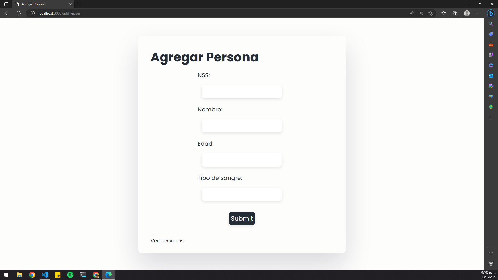

## Práctica 21 - Editar un documento en la colección de MongoDB

En esta práctica, se crea una aplicación web utilizando Express y MongoDB para editar documentos en una colección. La aplicación permite agregar personas a una base de datos y luego editar o eliminar personas existentes.

### Estructura de archivos

- **src/models/persons.js**: Define el esquema del modelo "Person" utilizando Mongoose.
- **src/routes/persons.js**: Contiene las rutas y lógica para manejar las operaciones CRUD de las personas.
- **src/views/addPerson.ejs**: Vista de formulario para agregar una nueva persona.
- **src/views/persons.ejs**: Vista que muestra una tabla con la lista de personas y opciones de actualización y eliminación.
- **src/views/updatePerson.ejs**: Vista de formulario para actualizar una persona existente.
- **src/server.js**: Archivo principal que configura la aplicación Express y establece la conexión con MongoDB.

### src/models/persons.js

Define el esquema del modelo "Person" utilizando Mongoose. El modelo representa un documento en la colección "Persons" de la base de datos.

### src/routes/persons.js

Contiene las rutas y lógica para manejar las operaciones CRUD de las personas.

- La ruta GET "/gente" obtiene todas las personas de la base de datos y las muestra en la vista "persons.ejs".
- La ruta GET "/addPerson" muestra el formulario para agregar una nueva persona.
- La ruta POST "/addPerson" recibe los datos del formulario y crea una nueva persona en la base de datos.
- La ruta GET "/deletePerson/:id" elimina una persona de la base de datos según su ID.
- La ruta GET "/findById/:id" encuentra una persona por su ID y muestra el formulario de actualización.
- La ruta POST "/updatePerson" actualiza una persona en la base de datos con los datos proporcionados en el formulario de actualización.

### src/views/addPerson.ejs

Una vista de formulario que muestra campos para agregar una nueva persona.

### src/views/persons.ejs

Una vista que muestra una tabla con la lista de personas obtenidas de la base de datos. Cada persona tiene opciones de actualización y eliminación.

### src/views/updatePerson.ejs

Una vista de formulario que muestra los datos de una persona existente y permite actualizarlos.

### src/server.js

El archivo principal que configura la aplicación Express y establece la conexión con MongoDB.

- Se establece la configuración de Express, se configura la carpeta "public" para servir archivos estáticos y se establece el motor de vista como "ejs".
- Se establece la conexión a la base de datos de MongoDB utilizando la URL proporcionada en el archivo de entorno (.env).
- Se inicia el servidor y se escucha en el puerto especificado.

Es importante asegurarse de tener todas las dependencias instaladas, como Express, Mongoose y dotenv, y de que la URL de conexión a la base de datos esté correctamente configurada en el archivo .env.

Esta práctica proporciona una base para crear una aplicación web que permite editar documentos en una colección de MongoDB. Puedes personalizar y ampliar esta aplicación según tus necesidades.
