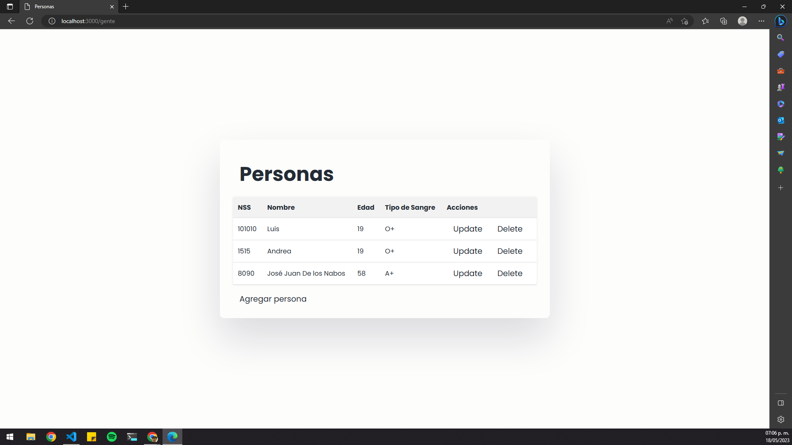
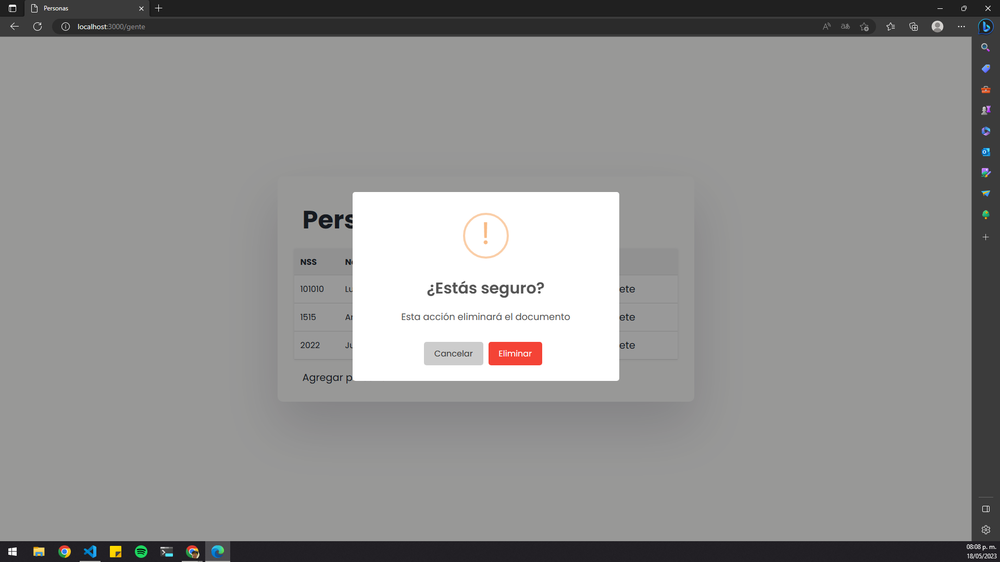

## Práctica 22 - Eliminar un documento de la colección de MongoDB

En esta práctica, se implementa la funcionalidad de eliminación de documentos en una colección de MongoDB utilizando Express y SweetAlert2. La aplicación permite eliminar personas de una base de datos MongoDB mediante una confirmación visual utilizando SweetAlert2.

### Estructura de archivos

- **src/models/persons.js**: Define el esquema del modelo "Person" utilizando Mongoose.
- **src/routes/persons.js**: Contiene las rutas y lógica para manejar las operaciones CRUD de las personas.
- **src/views/persons.ejs**: Vista que muestra una tabla con la lista de personas y opciones de actualización y eliminación.
- **src/views/updatePerson.ejs**: Vista de formulario para actualizar una persona existente.
- **src/views/deleteConfirmation.ejs**: Vista que muestra el SweetAlert2 para confirmar la eliminación de una persona.

### src/routes/persons.js

En el archivo `persons.js`, se añade la ruta `GET "/deletePerson/:id"` para eliminar una persona de la base de datos según su ID.

Al acceder a la ruta `GET "/deletePerson/:id"`, se muestra una vista `deleteConfirmation.ejs` que contiene el SweetAlert2 para confirmar la eliminación del documento. El SweetAlert2 se muestra utilizando estilos personalizados de UX/UI.

### src/views/persons.ejs

La vista `persons.ejs` muestra una tabla con la lista de personas obtenidas de la base de datos. Cada persona tiene opciones de actualización y eliminación.

Se ha añadido el atributo `class="btnDelete"` al enlace "Delete" correspondiente a cada persona en la tabla. Este atributo permite asignar un evento de click mediante JavaScript para mostrar el SweetAlert2 de confirmación antes de redirigir a la ruta de eliminación.

### Implementación de SweetAlert2

Para implementar SweetAlert2 en esta práctica, se han seguido los siguientes pasos:

1. Se ha agregado la referencia al archivo CSS de SweetAlert2 en el encabezado del archivo HTML principal.
2. Se ha agregado la referencia al archivo JavaScript de SweetAlert2 antes del cierre del cuerpo del archivo HTML principal.
3. Se ha configurado un mixin personalizado de SweetAlert2 en el archivo JavaScript correspondiente.
   - Se han definido clases CSS personalizadas para los elementos del SweetAlert2, siguiendo los principios de UX/UI.
   - Se ha desactivado el estilo predeterminado de los botones y se ha invertido el orden de los botones para seguir el flujo natural de lectura.
4. Se ha asignado el evento click a los enlaces de clase "btnDelete" utilizando JavaScript.
   - Al hacer clic en un enlace "Delete", se muestra el SweetAlert2 de confirmación.
   - Si se confirma la eliminación, se redirige al enlace original para ejecutar la acción de eliminación.

Esta implementación de SweetAlert2 mejora la experiencia de usuario al proporcionar una confirmación
