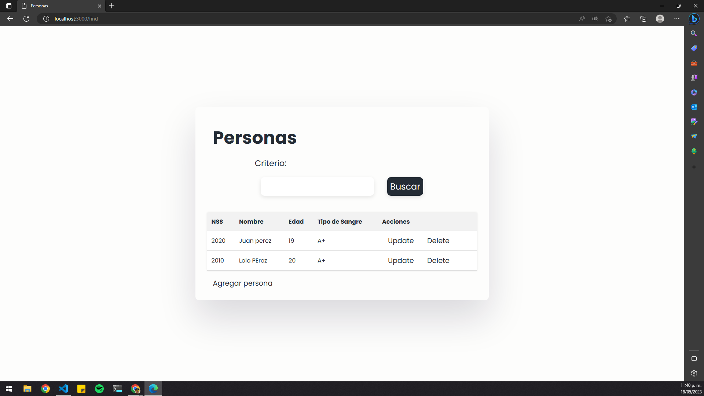

## Práctica 23: Incorpora un buscador de documentos a tu página Web

En esta práctica, se añade un buscador de documentos a una página web utilizando Express, MongoDB y SweetAlert2. La aplicación permite buscar personas en una base de datos MongoDB según un criterio especificado.

### Estructura de archivos

- **src/models/persons.js**: Define el esquema del modelo "Person" utilizando Mongoose.
- **src/routes/persons.js**: Contiene las rutas y lógica para manejar las operaciones CRUD de las personas.
- **src/views/persons.ejs**: Vista que muestra una tabla con la lista de personas y opciones de actualización y eliminación, además del formulario de búsqueda.
- **src/views/updatePerson.ejs**: Vista de formulario para actualizar una persona existente.
- **src/views/addPerson.ejs**: Vista de formulario para agregar una nueva persona.
- **src/views/deleteConfirmation.ejs**: Vista que muestra el SweetAlert2 para confirmar la eliminación de una persona.

### src/routes/persons.js

El archivo `persons.js` contiene las rutas y lógica para manejar las operaciones CRUD de las personas en la base de datos.

Se ha añadido la ruta `POST "/find"` para buscar personas según un criterio. Esta ruta utiliza el modelo "Person" y el método `find` de Mongoose para buscar en la colección "persons" por el campo "nombre" que coincida con el criterio especificado.

### src/views/persons.ejs

La vista `persons.ejs` muestra una tabla con la lista de personas obtenidas de la base de datos. Además, incluye un formulario de búsqueda que permite buscar personas según un criterio.

El formulario de búsqueda utiliza el método `POST` y la ruta `/find` para enviar el criterio al servidor. Al enviar el formulario, se realiza una petición al servidor y se actualiza la tabla con los resultados obtenidos.

### src/views/addPerson.ejs

La vista `addPerson.ejs` muestra un formulario para agregar una nueva persona a la base de datos. El formulario utiliza el método `POST` y la ruta `/addPerson` para enviar los datos al servidor y guardar la nueva persona en la colección "persons".

### src/views/updatePerson.ejs

La vista `updatePerson.ejs` muestra un formulario para actualizar una persona existente en la base de datos. El formulario utiliza el método `POST` y la ruta `/updatePerson` para enviar los datos al servidor y actualizar la persona correspondiente en la colección "persons".

### src/views/deleteConfirmation.ejs

La vista `deleteConfirmation.ejs` muestra un SweetAlert2 para confirmar la eliminación de una persona. Al confirmar la eliminación, se redirige al enlace original que ejecuta la acción de eliminación.

### Implementación del buscador de documentos

Para implementar el buscador de documentos en esta práctica, se han seguido los siguientes pasos:

1. Se ha agregado la ruta `POST "/find"` en el archivo `persons.js` para buscar personas según un criterio.
2. En la vista `persons.ejs`, se ha añadido un formulario de búsqueda que utiliza el método `POST` y la ruta `/find` para enviar el criterio al servidor.
3. En el archivo `persons.js`, se ha implementado la lógica para buscar personas en la base de datos según el criterio especificado.
4. Se ha actualizado la vista `persons.ejs` para mostrar los resultados de la búsqueda en la tabla.
5. Se ha actualizado el archivo `server.js` para incluir los archivos
